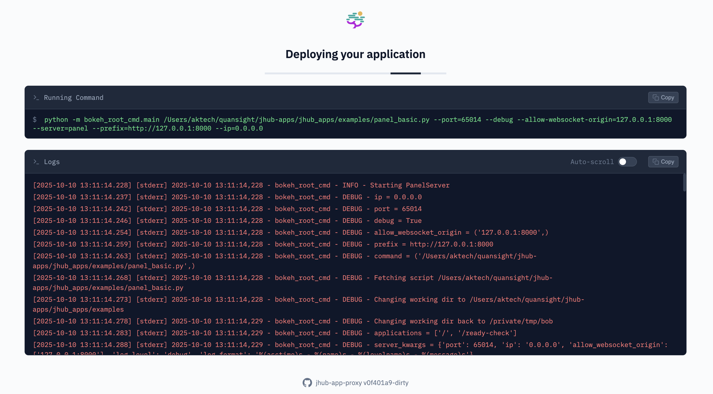

# JHub Apps Proxy

[](https://github.com/nebari-dev/jhub-app-proxy/actions/workflows/test.yml)
[](https://github.com/nebari-dev/jhub-app-proxy/actions/workflows/release.yml)
[](https://github.com/nebari-dev/jhub-app-proxy/actions/workflows/install-test.yml)
[](https://go.dev/)
[](LICENSE)
[](https://github.com/nebari-dev/jhub-app-proxy/releases)

A lightweight app proxy for JupyterHub applications that displays real-time startup logs before forwarding traffic to your app.



## Features

- **Real-time log viewing** - See your app's startup logs in a web interface
- **Smart proxying** - Automatically forwards traffic once your app is ready
- **Process management** - Handles conda environments, git repositories, and custom commands
- **Health checking** - Configurable health checks to determine when your app is ready
- **Zero downtime** - JupyterHub redirects users immediately to the log viewer

## Installation

### Quick Install (recommended)

```bash
curl -fsSL https://raw.githubusercontent.com/nebari-dev/jhub-app-proxy/main/install.sh | bash
```

Or with specific version:

```bash
curl -fsSL https://raw.githubusercontent.com/nebari-dev/jhub-app-proxy/main/install.sh | bash -s -- -v v0.1
```

### Manual Install

Download and run the install script:

```bash
wget https://raw.githubusercontent.com/nebari-dev/jhub-app-proxy/main/install.sh
chmod +x install.sh
./install.sh              # Install latest version
./install.sh -v v0.1      # Install specific version
./install.sh -d /usr/local/bin  # Custom install directory
```

### Alternative Methods

```bash
go install github.com/nebari-dev/jhub-app-proxy/cmd/jhub-app-proxy@latest
```

Or build from source:

```bash
make build
```

## Usage

```bash
jhub-app-proxy --port 8000 --destport 3000 \
  -- python -m http.server 3000
```

With conda environment:

```bash
jhub-app-proxy --port 8000 --destport 8501 \
  --conda-env my-env \
  -- streamlit run app.py
```

With git repository:

```bash
jhub-app-proxy --port 8000 --destport 8050 \
  --repo https://github.com/nebari-dev/jhub-apps-from-git-repo-example \
  --conda-env dashapp \
  -- python app.py
```

## How It Works

1. User clicks "Launch App" in JupyterHub
2. JHub Apps Proxy starts and immediately shows a log viewer (200 status)
3. JupyterHub redirects the user to see real-time startup logs
4. Once the app passes health checks, traffic is proxied to your application
5. User never sees a timeout or loading spinner

## Configuration

### Core Flags
- `--port` - Port for proxy server to listen on (default: 8888)
- `--destport` - Internal subprocess port (0 = random, default: 0)
- `--authtype` - Authentication type: `oauth`, `none` (default: `oauth`)

### Process Management
- `--conda-env` - Conda environment to activate before running command
- `--workdir` - Working directory for the process
- `--force-alive` - Force keep-alive to prevent idle culling (default: `true`)
- `--no-force-alive` - Disable force keep-alive, report only real activity

### Git Repository
- `--repo` - Git repository URL to clone before starting app
- `--repofolder` - Destination folder for git clone
- `--repobranch` - Git branch to checkout (default: `main`)

### Health Check
- `--ready-check-path` - Health check URL path (default: `/`)
- `--ready-timeout` - Health check timeout in seconds (default: 300)

### Logging
- `--log-level` - Log level: `debug`, `info`, `warn`, `error` (default: `info`)
- `--log-format` - Log format: `json`, `pretty` (default: `json`)
- `--log-buffer-size` - Number of subprocess log lines to keep in memory (default: 1000)
- `--log-caller` - Show file:line in logs (default: `false`)

### Progressive Streaming
- `--progressive` - Enable progressive response streaming, useful for Voila to show results as they're computed (default: `false`)

